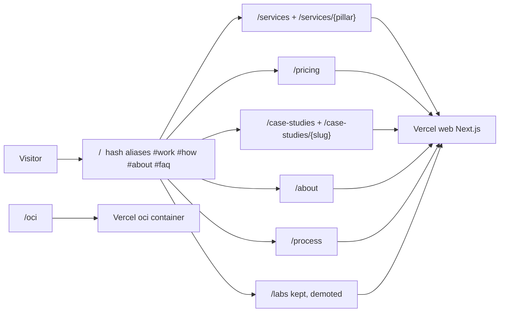
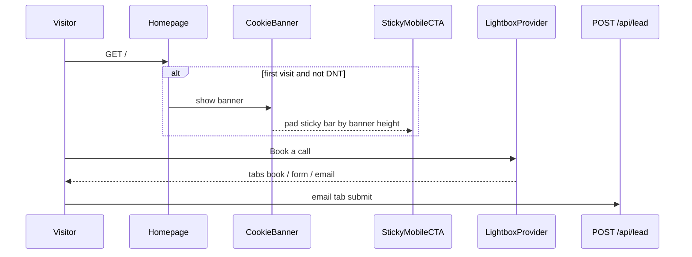
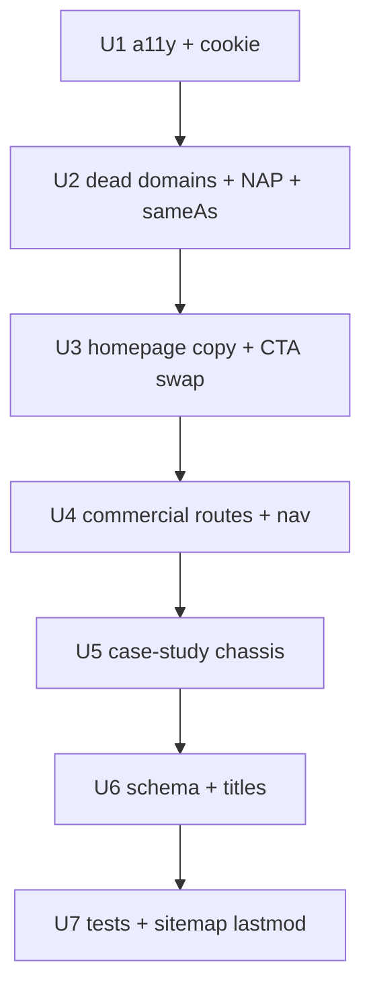

# feat: Reposition dobeu.net marketing for SMB buyers

## Goal Capsule

**Objective:** Turn the public marketing surface from a founder/portfolio landing into an SMB sales asset: outcome-led homepage copy, WCAG-safe contrast, no advertised dead domains, indexable commercial URLs, published pricing, and attributable proof — without deleting the shipped Immersive Canvas / `/labs` quality-gate infrastructure.

**Product authority:** The 2026-08-29 independent website audit is the commercial source of truth. Superdesign canvas drafts are visual direction, not implementation specification. `docs/plans/2026-08-29-001-feat-frontend-visual-labs-plan.md` remains authority for `/labs`, visual-regression, and mobile Lighthouse Performance ≥90. Portal, admin, `/company`, and `/oci` are out of scope.

**Stop conditions:** Stop if a unit would invent client names, testimonials, or unverifiable metrics. Stop if a new marketing path would collide with `/oci` or `/company`. Stop if a change would drop mobile Lighthouse Performance below 90 on `/` without an explicit follow-up plan to restore the gate.

**Open blockers:** None for planning. LinkedIn `sameAs` correction waits on operator confirmation of the live profile URL (default recorded below).

---

## Product Contract

### Summary

This plan covers the audit's this-week and this-month commercial layer on `dobeu.net`: fix contrast and screen-reader harm, stop advertising broken properties, rewrite the hero for operators who buy hours back, split homepage anchors into real URLs, publish price tiers, and add case-study pages that only show attributable work. It does not replace Immersive Canvas or `/labs`, does not migrate `dobeu.space`, and does not consolidate analytics.

### Problem Frame

dobeu.net is a strong engineering artifact and a weak sales asset for the stated SMB goal. The H1 sells "autonomous AI coding agents" to an audience that buys time and cost. Competitors that win the same niche (Business Mechanic, AI Consultant NYC) lead with named metrics, published tiers, and vertical language. The site also advertises dead domains, fails WCAG contrast on conversion chrome, and has one commercially indexable page.

The 2026-08-29 visual-labs plan already shipped the Immersive Canvas hero, `/labs`, visual-regression snapshots, and a hard Lighthouse Performance gate. Those are assets. The audit says the *copy, proof, and IA* on top of that infrastructure are what fail to convert.

### Actors

- A1. SMB operator (distribution, fleet, food-service, 10–200 employees) — primary buyer.
- A2. Technical founder — secondary; current homepage is written for them; keep a path, demote it.
- A3. Screen-reader / reduced-motion visitor — must hear a stable H1 and see content without contrast or `aria-live` traps.
- A4. First-visit consent visitor on mobile — must reach Book a call without the cookie banner covering it.
- A5. Implementer / CI — `pnpm verify`, Playwright smoke + visual, Lighthouse CI on `/` and `/labs`.

### Requirements

**Trust and accessibility**

- R1. Hero greeting, capability-card body, trust chips (including "No agency overhead"), and "Tell me about your project" meet WCAG 2.1 AA contrast (≥4.5:1 normal text, ≥3:1 large text) on every hero background frame, including the shader/gradient.
- R2. The typewriter is decorative: final destination text is in the DOM; the animated layer is `aria-hidden`; no `aria-live` inside the H1. Extracted H1 text includes a space between "Jeremy." and "I ship".
- R3. Public chrome never prints or links `dobeutech.com`, `dobeu.cloud`, or `dobeu.dev`.
- R4. One NAP constant is the only source for location copy and schema. Default: Dobeu Tech Solutions LLC, New York, NY, `jeremyw@dobeu.net`, `areaServed` NYC + NJ metro. No invented street address.
- R5. Person and Organization `sameAs` lists only verified live profiles. Do not add dead hosts. Correct the LinkedIn URL once the operator confirms it (default: treat `FOUNDER.linkedin` as suspect per the audit; prefer the GitHub-listed profile if it resolves).
- R6. "50+ Projects shipped" is removed or replaced with a checkable claim. No new testimonial or logo wall unless the quote is attributable.

**Positioning and homepage**

- R7. Homepage H1 and subhead are outcome-led for A1 (hours back, errors gone, you own the code). Distinctive terse voice stays. Stack names (Claude, Composio, MCP, Next.js) do not lead above the fold.
- R8. Hero primary CTA remains Book a call (existing lightbox). Secondary CTA is `/pricing` until at least one attributable case-study page is live (metric-less is enough), then `/case-studies`. "Explore the lab" is not a hero or primary-nav CTA. `/labs` stays routed, sitemapped, Lighthouse-gated, and linked from footer / Universe only.
- R9. Cookie banner does not cover first-paint hero CTAs or `StickyMobileCTA` on first visit, including `md+` (`bottom-4` banner vs hero cluster). While `!consent.decided`, pad `StickyMobileCTA` by the banner height — do not hide the sticky bar. `StickyMobileCTA` ships on the homepage only. Consent model, DNT auto-decline, and `dobeu:consent-changed` stay intact.

**Indexable commercial IA**

- R10. Real static URLs exist for `/services`, `/services/{pillar}`, `/pricing`, `/about`, `/process`, `/case-studies`, `/case-studies/{slug}`. Homepage section ids `#work`, `#how`, `#about`, `#faq` remain so `/#about` bookmarks still land, each with `scroll-margin-top` ≥ 60px so the sticky nav does not cover the heading.
- R11. `/pricing` publishes diagnostic (sub-$5k), single-workflow, full-build, and ongoing tiers aligned with the existing FAQ $5k–$30k band, plus Service/Offer schema. The homepage first screen also shows that price line (diagnostic + $5k–$30k).
- R12. Case-study pages use only attributable facts (public GitHub-backed `SHIPPED_WORK`, or a client-approved metric). A large metric heading renders only when `approved: true`. Metric-less heroes are name + vertical + problem + stack/year/repo + Book a call. No illustrative placeholder numbers. No invented client names.
- R13. Nav and footer use absolute marketing paths (`/services`, `/process`, `/about`, `/pricing`, `/#faq`). Hash-only links are not used off the homepage. Primary SMB nav omits `/labs`.
- R14. `app/sitemap.ts` lists every new public URL, including each `/case-studies/{slug}`, with a per-URL `lastModified` that is not `new Date()` at build time. Each new page — including `app/services/[pillar]/page.tsx` and `app/case-studies/[slug]/page.tsx` — sets `generateMetadata` with `alternates.canonical`.

**Schema and metadata**

- R15. Marketing pages emit `ProfessionalService` (with `areaServed`). `/pricing` and each `/services/{pillar}` emit `Service` + `Offer` ($5k–$30k `priceRange`). Nested routes also emit `BreadcrumbList`. FAQPage JSON-LD stays on the page that still renders the FAQ (homepage unless FAQ moves). Root WebSite/Person/Organization `sameAs` and NAP live only in the root layout (U2). Page-level graphs must not emit a second Person.
- R16. Homepage `<title>` and description lead with service + geography, not the personal name. Remove `<meta name="keywords">`.

### Key Flows

- F1. Cold visit: land on `/` → read outcome H1 → see price band → Book a call opens the existing lightbox (book / form / email).
- F2. First-visit (any viewport): cookie banner visible → first-paint hero Book a call stays clickable → after scroll, padded sticky Book a call stays clickable → consent can be decided without losing either CTA.
- F3. Legacy bookmark: `/#about`, `/#how`, `/#work`, `/#faq` still scroll to those sections on `/`.
- F4. Diligence: visitor opens `/pricing` or `/case-studies` from nav or hero secondary CTA → reads tiers or attributable work → Book a call.
- F5. Inner-page nav: from `/labs` or `/pricing`, Services/Process/About go to real paths, not `/labs#how`.

### Acceptance Examples

- AE1. When a contrast checker samples "No agency overhead" and "Tell me about your project" on the hero, both ratios are ≥4.5:1. Covers R1.
- AE2. When a screen reader focuses the H1, it announces a single stable phrase with a space after "Jeremy." and does not re-read on each typewriter tick. Covers R2.
- AE3. When a visitor views the footer and Universe menu, none of `dobeu.cloud`, `dobeutech.com`, or `dobeu.dev` appear. Covers R3.
- AE4. When a first-visit viewport has the cookie banner open, the hero Book a call is fully visible; after scroll the padded sticky Book a call is fully visible and clickable. Covers R9 / F2.
- AE5. When `/about` is requested, a 200 static page renders with its own title/canonical, and `/#about` on `/` still scrolls to the founder section. Covers R10 / F3.
- AE6. When `/pricing` is requested, published tiers include a sub-$5k diagnostic and the $5k–$30k build band, and Offer JSON-LD is present. Covers R11 / R15.
- AE7. When a case-study page has no client-approved metric, it does not invent one; it may show stack, year, and public repo only. Covers R12 / R6.
- AE8. After merge, `pnpm test:e2e` and Lighthouse CI still gate `/` and `/labs` at mobile Performance ≥90. Covers R8.

### Success Criteria

- A1 can tell in one screen what is sold, who it is for, what it costs (homepage price line: diagnostic + $5k–$30k), and how to book.
- Critical audit items 1–6 and 9–11 from the priority table are addressed in code (contrast, aria-live, dead domains, sameAs, NAP, H1 rewrite, page split, pricing, cookie banner). Case studies and testimonials ship only as templates plus attributable `SHIPPED_WORK` until real client quotes exist.
- No Lighthouse Performance gate regression. No `/oci` or `/company` collision.

### Scope Boundaries

**In scope**

- Public marketing chrome and homepage commercial layer.
- New static App Router pages listed in R10–R12.
- Schema, sitemap, metadata, smoke/visual test updates.

**Deferred to Follow-Up Work**

- `/insights` migration and `dobeu.space` 301s (requires that host to point at this Vercel project or redirect at its current host).
- Geo landing pages (`/ai-automation-consultant-nyc`, `/ai-automation-new-jersey`).
- Absorbing `dobeu.tech` coaching into the nav (pricing can mention a diagnostic without owning that domain).
- Analytics consolidation, nonce CSP, polyfill/JS trim, shader-after-LCP.
- `/labs` → `/experiments` rename (301 + sitemap + e2e + Lighthouse URL updates).
- Clutch/G2 profiles, Reddit/X/HN posting, Show HN tool (operator/GTM, not this repo).
- Replacing Immersive Canvas with a different visual system.

**Outside this product's identity**

- Invented social proof.
- A second Vercel project for marketing IA.
- Routing marketing HTML through the `oci` container.

### Sources

- Origin audit: `docs/audits/2026-08-29-dobeu-net-website-audit.md`
- Prior visual-labs plan: `docs/plans/2026-08-29-001-feat-frontend-visual-labs-plan.md`
- Superdesign canvas: [dobeu.net SMB landing reposition](https://superdesign.dev/teams/3b3b069d-0163-4382-8d2e-b0892848cc08/projects/4f848575-e467-48a9-946d-9f5be31e891b) — baseline [Current homepage](https://p.superdesign.dev/draft/904b6f3a-ffd5-4173-b6c9-b2584daaaee8), branch [SMB Outcome](https://p.superdesign.dev/draft/b10739c0-8364-4009-b019-75bec69bdf78), branch [Case-study](https://p.superdesign.dev/draft/3d4c9015-e5c4-4a98-8174-8370ffd86273)
- Competitor extracts: `.superdesign/website/biz-mech.com/`, `.superdesign/website/aiconsultantnyc.com/`
- Brand ethics: `AUDIT.md` (Proof.tsx removal)

---

## Planning Contract

### Key Technical Decisions

- KTD1. Extend visual-labs; do not supersede it. Keep Immersive Canvas, `/labs`, visual-regression, and `lighthouserc.cjs` ≥90. Rewrite copy, contrast, CTAs, and IA on top. Chosen over deleting `/labs` or replacing the shader hero in this PR: those are shipped CI investments; the audit's conversion gap is commercial, not missing atmosphere.
- KTD2. Overturn the v3 "one scrolling page" rule for commercial URLs. Keep homepage hash ids as aliases. Chosen over hash-only nav: a 301 cannot map `/#about` → `/about`, and competitors rank on real service/pricing/case-study URLs.
- KTD3. Default positioning is audit Angle 1 (vertical AI ops for logistics / fleet / food service). Founder/craft language stays below the fold and on `/labs`. Chosen over Angle 2 (fractional CTO) and Angle 3 (founder peer) as the homepage: Angle 1 is the only claim the competitive set cannot copy.
- KTD4. Content stays in `lib/jeremy-data.ts` (or a sibling `lib/marketing-data.ts` if the file splits). No CMS. New pages are static Server Components composing existing section components. U3/U4 migrate hardcoded `Services` / `HowItWorks` / `FAQ` arrays into that module and extend `GTM_PILLARS` (or `PILLAR_PAGES`) with description / detail / tag so homepage and pillar pages share one source.
- KTD5. New pages live only under root `app/` on the `web` service. No extra `vercel.json` rewrites. Never `/oci`, `/company`, `/portal`, `/admin`, `/api`.
- KTD6. Proof policy matches `AUDIT.md`: no fabricated quotes. `SHIPPED_WORK` may power product case studies (name, stack, year, public repo). Metric headlines require `approved: true`. Do not ship illustrative placeholder numbers on the hero or as a labeled stand-in.
- KTD7. Cookie-banner fix: keep the existing bottom card. While `!consent.decided`, pad `StickyMobileCTA` by the banner height on every viewport — do not hide the sticky bar. Also keep first-paint hero CTAs clear of the banner (hero cluster padding / safe area), including `md+`. `StickyMobileCTA` remains homepage-only. Chosen over a top banner: less homepage layout shift; preserves the current consent component.
- KTD8. Git preview is off (`vercel.json` `deploymentEnabled.main` only). Ship as independently safe `main` merges (trust/a11y first, then IA) or a protected CLI preview. Do not assume a PR preview URL.
- KTD9. Superdesign drafts are direction. Implement with existing Tailwind tokens, Nunito, and `DobeuMark` — do not port generated HTML. Preferred direction after review: SMB Outcome draft for hero/IA; Case-study draft for the proof row pattern.
- KTD10. Schema ownership: U2 owns root Person/Organization `sameAs` + NAP in `app/layout.tsx`. U6 owns page-level ProfessionalService / Service / Offer / BreadcrumbList plus homepage title and keywords removal. SearchAction cleanup (`/?s=` has no search route) is optional follow-up, not a U6 blocker. Do not emit a second Person graph per page. FAQPage stays with the FAQ UI.
- KTD11. Analytics consolidation is out of scope. Providers stay feature-flagged by `NEXT_PUBLIC_*`. CSP shrink is a follow-up after a code+rebuild+env sequence, not this plan.

### Assumptions

- Canonical location is New York, NY (homepage today). Neptune City, NJ on sister sites is treated as stale.
- LinkedIn correction defaults to verifying `https://www.linkedin.com/in/jswilliamstu` before swapping `FOUNDER.linkedin` and JSON-LD; if that URL is wrong, keep the current URL and document it.
- A sub-$5k diagnostic tier is a published offer, not a new booking product. The existing lightbox remains the conversion mechanism.
- `dobeu.space` stays linked only if it resolves; otherwise drop it from Universe with the dead domains.
- Operator will supply real case-study metrics later; this plan ships the page chassis now.

### High-Level Technical Design

**IA and routing (web service only)**



**Conversion sequence**



**Ship sequence**



**Page composition (directional)**

```
MarketingPage
  LightboxProvider
    SiteNav          // absolute paths
    main
      page-specific sections (reuse Founder / HowItWorks / Services excerpts)
    SiteFooter       // live properties only
    StickyMobileCTA  // homepage only
```

New routes follow `app/labs/page.tsx` (nav + footer + lightbox), not `LegalLayout`, except that legal pages stay on `LegalLayout`. Reused sections take a `variant="standalone"` (or equivalent): no duplicate `#work` / `#how` / `#about` ids, and the page-level `<h1>` lives outside the reused section.

### Implementation Constraints

- `next.config.ts` is the only Next config. Never add `next.config.js`.
- Marketing pages stay static: no `cookies()`, `headers()`, `createClient()`, or `force-dynamic`.
- No `runtime = "edge"` on sitemap, robots, OG, or marketing pages.
- New third-party hosts (Clutch/G2/YouTube) need CSP arrays in `next.config.ts` plus `images.remotePatterns` if using `next/image`. This plan does not add those widgets.
- `SiteNav` hash links break on inner pages today (`/labs#how`). Absolute paths are mandatory once IA splits.
- Visual snapshots and `e2e/smoke.spec.ts` ("Jeremy Williams" title, "Explore the lab") will fail until updated in U7.
- Brand mark: use `components/brand/DobeuMark.tsx` / `public/brand/*`, never invented SVGs.

### Sequencing

Phase A (trust): U1 → U2 → U3. Can merge independently.
Phase B (IA + proof + schema + tests): U4 → U5 → U6 → U7.

---

## Implementation Units

### U1. Accessibility contrast, typewriter, cookie-banner collision

**Goal:** Critical WCAG and CRO defects on first paint are gone.
**Requirements:** R1, R2, R9. Covers AE1, AE2, AE4.
**Dependencies:** none
**Files:**
- `app/globals.css`
- `components/landing/Hero.tsx`
- `components/CookieBanner.tsx`
- `components/landing/StickyMobileCTA.tsx`
- `hooks/use-cookie-consent.test.ts`
- `e2e/smoke.spec.ts` (add an unseeded-consent mobile overlap assertion in U7 if not ready here)
**Approach:**
1. Stop stacking `/45` and `/50` on `text-muted-foreground` in the hero greeting, cards, and ghost CTA. Put trust chips and ghost CTA on `bg-card` / solid surfaces so they do not sit on the amber shader.
2. Render the current typewriter phrase (or a static H1) in an accessible node; mark the animated span `aria-hidden`; delete `aria-live` / `aria-atomic` from the H1. Keep a space between the two H1 lines in the accessible text.
3. While `!consent.decided`, pad `StickyMobileCTA` by the banner height on every viewport — do not hide the sticky bar. Keep first-paint hero CTAs above the banner (hero bottom safe-area / extra padding), including `md+`. Do not change the consent cookie shape or DNT path.
**Patterns to follow:** `hooks/use-motion-props.ts` (systematic a11y, not one-off); `e2e/helpers.ts` `seedCookieConsent` stays for visual tests.
**Test scenarios:**
- Happy path: greeting, chip body, "No agency overhead", and ghost CTA each have computed contrast ≥4.5:1 on light theme.
- Edge: dark theme primary/accent swap still meets AA for the same strings.
- Error: DNT visitors still see no banner and a clickable Book a call.
- Integration: with consent undecided, first-paint hero Book a call is fully visible; after scrollY > 600 the sticky Book a call target is not covered by the banner box on mobile or `md+`.
**Verification:** Manual contrast sample plus a unit or RTL assertion that the H1 accessible name is stable and contains "Jeremy. I". Cookie tests still pass.

### U2. Dead-domain and entity hygiene

**Goal:** Public chrome and JSON-LD stop leaking broken properties and conflicting identity.
**Requirements:** R3, R4, R5, R6.
**Dependencies:** none (can parallel U1)
**Files:**
- `lib/jeremy-data.ts`
- `components/landing/SiteFooter.tsx`
- `components/landing/SubBrandsStrip.tsx`
- `components/landing/SiteNav.tsx`
- `components/landing/Founder.tsx`
- `app/layout.tsx`
- `lib/jeremy-data.test.ts` (create if needed)
**Approach:**
1. Export a single `NAP` / `SITE_IDENTITY` object (legal name, city, email, `areaServed`). Point footer, founder line, and schema at it.
2. Remove `dobeu.cloud` and `dobeutech.com` from the footer tagline. Remove `dobeu.dev` from `SUB_BRANDS`. Drop `dobeu.space` if it does not resolve at implementation time.
3. Split Person vs Organization `sameAs`. Person: verified LinkedIn + GitHub. Organization: company LinkedIn if it exists, else omit LinkedIn rather than reuse the personal URL.
4. Replace Founder "50+ Projects shipped" with a checkable line (e.g. public repo count is not a substitute — prefer "Building since 2019" + shipped-product names from `SHIPPED_WORK`).
**Patterns to follow:** `FOUNDER` already centralizes identity; extend it rather than scattering strings.
**Test scenarios:**
- Happy path: grep-equivalent test that rendered footer/nav strings exclude the three dead hosts.
- Edge: `SUB_BRANDS` length and hrefs only include http(s) hosts intended to stay live.
- Error: JSON-LD `sameAs` arrays contain no `dobeu.cloud` / `dobeutech.com` / `dobeu.dev`.
**Verification:** `pnpm test:ci` on the new assertions; view-source of `/` shows corrected `sameAs`.

### U3. Outcome-led homepage copy and hero CTA swap

**Goal:** First screen sells the meal, not the stack.
**Requirements:** R7, R8, R11. Covers F1.
**Dependencies:** U1 (contrast surfaces exist), U2 (NAP/location chips consistent)
**Files:**
- `lib/jeremy-data.ts` (`TYPEWRITER_PHRASES`, `HERO_CAPABILITY_CARDS`, `SHOW_LABS_HERO_CTA`, `GTM_PILLARS`, plus migrated `SERVICES` / process / FAQ copy)
- `components/landing/Hero.tsx`
- `components/landing/Services.tsx`
- `components/landing/HowItWorks.tsx`
- `components/landing/FAQ.tsx`
- `components/landing/FinalCTA.tsx`
- `app/page.tsx` (title/description — final polish in U6)
**Approach:**
1. Rewrite H1/subhead per audit Angle 1. If the typewriter stays, rotate vertical outcomes (dispatch, compliance paperwork, inventory reconciliation, invoicing), not "autonomous AI coding agents."
2. Capability cards use `GTM_PILLARS` pain language, not stack labels. Default `SHOW_LABS_HERO_CTA` to false. Secondary button links to `/pricing` until ≥1 attributable case-study page is live (metric-less counts), then `/case-studies` — U5 flips that flag when the index ships.
3. Keep Book a call → `useLightbox("book")` and the ghost form CTA. Do not add a third competing primary.
4. Publish a first-screen price line (diagnostic + $5k–$30k) matching the Superdesign SMB Outcome draft. Do not port HTML.
5. Move hardcoded `Services` / `HowItWorks` / `FAQ` arrays into `jeremy-data.ts` or `marketing-data.ts` (KTD4) so U4 pillar pages reuse the same source.
**Patterns to follow:** existing `track("cta_click", …)` on hero buttons; `useMotionProps`.
**Execution note:** Update smoke selectors in the same commit if they assert the old H1 or labs CTA; otherwise land U7 immediately after.
**Test scenarios:**
- Happy path: hero accessible name / visible H1 does not contain "autonomous AI coding agents."
- Happy path: first screen includes a diagnostic + $5k–$30k price line.
- Happy path: secondary CTA href is `/pricing` or `/case-studies`, never `/labs`.
- Edge: `NEXT_PUBLIC_SHOW_LABS_HERO_CTA=true` can still show labs for an operator override.
- Integration: Book a call still opens the lightbox book tab.
**Verification:** Homepage copy review against R7; lightbox still opens; `/labs` remains 200.

### U4. Commercial routes, nav, and sitemap entries

**Goal:** Services, pricing, about, and process are real indexable pages; inner-page nav works.
**Requirements:** R10, R11, R13, R14. Covers AE5, AE6, F3, F5.
**Dependencies:** U3 (shared copy), U2 (NAP)
**Files:**
- `app/services/page.tsx`
- `app/services/[pillar]/page.tsx`
- `app/pricing/page.tsx`
- `app/about/page.tsx`
- `app/process/page.tsx`
- `components/landing/SiteNav.tsx`
- `components/landing/SiteFooter.tsx`
- `components/landing/Services.tsx`
- `components/landing/HowItWorks.tsx`
- `components/landing/Founder.tsx`
- `app/sitemap.ts`
- `app/globals.css` (homepage hash `scroll-margin-top` ≥ 60px if not already set in U1)
- `app/services/[pillar]/page.test.ts` or a route-level vitest if the repo pattern prefers it
**Approach:**
1. Add static pages that reuse `Services`, `HowItWorks`, `Founder` excerpts plus a page-level `<h1>` outside the reused block. Reused sections take `variant="standalone"` (or equivalent) so they do not emit `#work` / `#how` / `#about`. Pillar slugs match extended `GTM_PILLARS` / `PILLAR_PAGES` ids. `generateStaticParams` for pillars. Keep homepage section `id`s and give them `scroll-margin-top` ≥ 60px.
2. Each new page, including `app/services/[pillar]/page.tsx`, exports `generateMetadata` with `alternates.canonical`.
3. Pricing page: four tiers (diagnostic sub-$5k, single workflow, full build $5k–$30k, month-to-month after launch). CTA is the existing lightbox, not a new checkout.
4. Change nav labels Work → Services (`/services`), Process → `/process`, About → `/about`, add Pricing → `/pricing`. Omit `/labs` from primary SMB nav; keep it in footer / Universe. Footer Site column matches. FAQ stays `/#faq` from inner pages (homepage FAQ).
5. Append new URLs to the hand-maintained sitemap list. Per-URL `lastModified` from a content date constant, not `new Date()`.
**Patterns to follow:** `app/labs/page.tsx` shell; `getSiteUrl()` + `alternates.canonical`; never `app/company`.
**Test scenarios:**
- Happy path: each new path returns 200 in e2e and appears in `/sitemap.xml`.
- Happy path: `/services/{pillar}` metadata includes a canonical matching that slug.
- Edge: unknown `/services/not-a-pillar` is 404.
- Edge: `/#about` on `/` still reveals `#about` below the sticky nav (`scroll-margin-top`).
- Edge: primary nav has no Labs item; footer or Universe still links `/labs`.
- Integration: from `/pricing`, clicking Process goes to `/process`, not `/pricing#how`.
- Error: no new rewrite in `vercel.json`.
**Verification:** `curl` sitemap lists the new loc values with `https://dobeu.net` hosts; pages are statically generated in the build manifest (not λ/dynamic).

### U5. Case-study chassis from attributable work

**Goal:** A proof URL exists that does not violate brand ethics.
**Requirements:** R12, R6. Covers AE7, F4.
**Dependencies:** U4 (nav/sitemap pattern)
**Files:**
- `app/case-studies/page.tsx`
- `app/case-studies/[slug]/page.tsx`
- `app/sitemap.ts` (per-slug `lastModified` when routes land)
- `lib/jeremy-data.ts` (`SHIPPED_WORK` + optional `metrics?: { label: string; approved: boolean }`)
- `lib/jeremy-data.test.ts`
- `e2e/smoke.spec.ts` (link presence)
**Approach:**
1. Index lists `SHIPPED_WORK` entries. Detail page shows name, category, description, stack, year, public GitHub. Omit testimonial blocks.
2. Only render a large metric heading when `approved: true`. Otherwise the hero is name + vertical + problem + stack/year/repo + Book a call — no numeric claim and no illustrative placeholder.
3. Flip the hero secondary CTA to `/case-studies` as soon as ≥1 attributable page is live (metric-less is enough). Promoting an approved metric on the index is a later content edit, not this flag.
4. `app/case-studies/[slug]/page.tsx` exports `generateMetadata` with `alternates.canonical`. Add each slug to `app/sitemap.ts` with its content `lastModified`.
5. Visual direction: Superdesign Case-study draft for card layout — content remains attributable.
**Patterns to follow:** unused `SHIPPED_WORK` is the approved content source; `AUDIT.md` Proof removal is the ethics gate.
**Test scenarios:**
- Happy path: `/case-studies/lastplate` renders LastPlate description and GitHub link.
- Edge: an entry without `approved` metrics has no "90%" / hours-saved heading.
- Error: unknown slug 404s.
- Integration: sitemap includes each generated slug.
**Verification:** No file in the unit contains placeholder client names (Acme, "Jane D.").

### U6. ProfessionalService schema and metadata

**Goal:** Machines can quote price, service area, and the right person.
**Requirements:** R15, R16. Covers AE6.
**Dependencies:** U2 (root NAP/sameAs already in `app/layout.tsx`), U4 (pages exist), U5 (case-study slugs exist)
**Files:**
- `app/page.tsx`
- `app/pricing/page.tsx`
- `app/services/page.tsx`
- `app/services/[pillar]/page.tsx`
- `app/case-studies/[slug]/page.tsx`
- `components/landing/FAQ.tsx` (only if FAQ leaves `/`)
- `lib/utils.ts` (`safeJsonLdStringify`)
- `lib/jsonld.test.ts` (create)
**Approach:**
1. Do not re-edit root Person/Organization `sameAs` or NAP — that is U2. SearchAction cleanup (`/?s=` has no search route) is optional follow-up.
2. Add a small JSON-LD builder: ProfessionalService on marketing pages; Service + Offer on `/pricing` and each `/services/{pillar}`; BreadcrumbList on `/services/{pillar}` and `/case-studies/{slug}`.
3. Homepage title: service + geography (audit S12). Delete `keywords` from root metadata.
**Patterns to follow:** existing `@graph` in `app/layout.tsx` and FAQPage in `FAQ.tsx`; `safeJsonLdStringify`.
**Test scenarios:**
- Happy path: parsed JSON-LD on `/pricing` includes Offer `priceRange` containing 5000 and 30000 (or equivalent text).
- Happy path: `/services/{pillar}` JSON-LD includes Service + Offer, not only BreadcrumbList.
- Edge: page-level graphs do not emit a second Person (root layout remains the Person owner).
- Error: FAQPage appears on at most the page that renders FAQ UI.
**Verification:** Structured-data shape tests; no `keywords` meta in rendered `/`.

### U7. Smoke, visual baselines, sitemap lastmod, Lighthouse non-regression

**Goal:** CI matches the new commercial layer.
**Requirements:** R8, R14. Covers AE8.
**Dependencies:** U1–U6
**Files:**
- `e2e/smoke.spec.ts`
- `e2e/visual/landing.spec.ts` (+ snapshots)
- `e2e/helpers.ts`
- `app/sitemap.ts`
- `lighthouserc.cjs` (keep `/` and `/labs`; do not add every new URL as a hard gate in this plan)
**Approach:**
1. Replace title and labs-CTA assertions. Add coverage for `/pricing`, `/services`, `/case-studies`, and the unseeded cookie/sticky overlap.
2. Update visual baselines after copy/contrast/nav changes.
3. Confirm Lighthouse URLs still `/` and `/labs` only — new pages are informational until they prove stable.
**Execution note:** Prefer smoke-first proof on the new routes; visual snapshots last after copy settles.
**Test scenarios:**
- Happy path: smoke visits `/`, `/pricing`, `/services`, `/case-studies`, `/labs`, `/about`, `/process`.
- Integration: sitemap.xml contains those paths and does not use an identical build-now timestamp for every URL (legal pages may share a constant date; money pages use their content date).
- Error: labs page still 200 and remains in Lighthouse CI.
**Verification:** `pnpm test:e2e` and `pnpm lighthouse:ci` (or the CI job) pass.

---

## Verification Contract

Repo commands (from `CLAUDE.md`):

- `pnpm type-check`
- `pnpm lint`
- `pnpm test:ci` — include new jeremy-data / JSON-LD / contrast-adjacent unit tests
- `pnpm test:e2e` — smoke + visual after baseline refresh
- `pnpm build` — confirm new marketing routes are static
- CI `.github/workflows/ci.yml` also runs `pnpm lighthouse:ci` (mobile Performance ≥90 on `/` and `/labs`)

Do not treat `pnpm build:strict` engines warning as in-scope. Do not assume a Vercel git preview exists.

Manual (required for UI units): first-visit mobile `/` with cookies cleared — banner vs sticky CTA vs Book a call; then `/pricing` and one case-study slug. Superdesign drafts are review aids, not pass/fail.

---

## Definition of Done

**Global**

- R1–R16 are each cited by at least one unit and verified there.
- Dead hosts are absent from public chrome and JSON-LD.
- `/labs` still exists and remains a Lighthouse target.
- No invented testimonials or metrics.
- Abandoned Superdesign HTML is not copied into `app/`.
- `pnpm verify` equivalent gates used in CI are green, or failures are only updated snapshots intentionally re-baselined.

**Per unit**

- U1: AE1, AE2, AE4 pass.
- U2: AE3 plus sameAs/NAP consistency.
- U3: F1 uses outcome copy; first screen shows the price line; labs is not the hero secondary.
- U4: AE5, AE6 routes exist and nav is absolute.
- U5: AE7 holds for every slug.
- U6: Offer/ProfessionalService present; keywords meta gone.
- U7: AE8 CI green.

---

## System-Wide Impact

- **SEO:** URL inventory grows; sitemap and canonicals must stay hand-maintained.
- **CI:** Visual and smoke selectors churn; Lighthouse surface stays `/` + `/labs`.
- **Consent:** Banner geometry changes; cookie schema does not.
- **Deploy:** First public URL is production unless a CLI preview is used. Prefer Phase A merge before Phase B.
- **CSP:** Unchanged unless a later plan adds review widgets.

---

## Risks & Dependencies

| Risk | Mitigation |
| --- | --- |
| Visual-labs vs audit conflict | KTD1: keep infrastructure, change commercial layer |
| Brand-ethics regression | KTD6; U5 forbids unapproved metrics |
| Lighthouse regression from more above-fold copy | Keep shader mobile skip; no new third-party scripts; U7 watches the gate |
| Hash bookmarks die | Keep section ids on `/` |
| `/company` collision | Use `/about` |
| No git preview | KTD8 split merges or CLI preview |
| Wrong LinkedIn | Deferred confirm; do not add a second person's profile |
| Superdesign HTML drift | KTD9 implement in React/Tailwind |

**Dependencies:** Operator confirmation of LinkedIn URL (non-blocking; default recorded). Real client metrics are not a dependency for chassis ship.

---

## Open Questions

- Q1. **Deferred.** Confirm live LinkedIn vanity URL before swapping `sameAs`. Default: verify `jswilliamstu`, else keep current.
- Q2. **Deferred.** When the first `approved: true` client metric exists, promote that number on the `/case-studies` index and any homepage proof row. The hero secondary already switches to `/case-studies` as soon as ≥1 attributable page is live (R8 / U5) — do not wait on this metric.

Neither blocks implementation-ready status.

---

## Documentation / Operational Notes

- After Phase A merge, curl production headers still come from `next.config.ts` (no `next.config.js`).
- `dobeu.cloud` / `dobeu.dev` / `dobeutech.com` DNS/TLS are registrar work; this plan only stops advertising them.
- `docs/DEPLOYMENT.md` preview-URL QA is stale vs `vercel.json` main-only git deploys — do not plan around PR previews.
- Superdesign project id `4f848575-e467-48a9-946d-9f5be31e891b`. Resume: `.superdesign/resume.json`.
